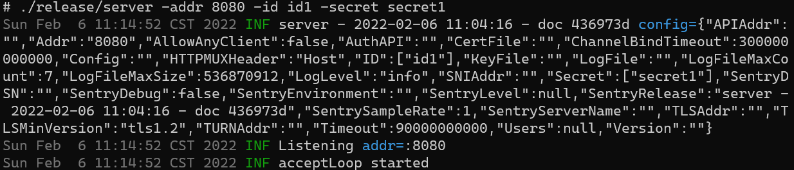
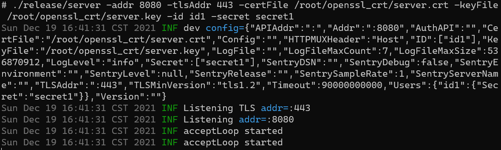

# gt

[English](./doc/English.md)

专注于高性能，低延迟，省内存的内网穿透解决方案。

1. 支持 HTTP、WebSocket 协议。
2. 服务端支持配置多个用户。
3. 服务端与客户端之间通信采用 TCP 连接池。
4. 日志支持上报到 Sentry 服务。

## 目录

- [工作原理](#工作原理)
- [示例](#示例)
  - [HTTP 内网穿透](#http-内网穿透)
  - [HTTPS 解密成 HTTP 后内网穿透](#https-解密成-http-后内网穿透)
  - [HTTPS 直接内网穿透](#https-直接内网穿透)
  - [TLS 加密客户端服务端之间的 HTTP 通信](#tls-加密客户端服务端之间的-http-通信)
- [参数](#参数)
  - [客户端参数](#客户端参数)
  - [服务端参数](#服务端参数)
  - [配置文件](#配置文件)
  - [服务端配置 users](#服务端配置-users)
    - [通过命令行](#通过命令行)
    - [通过 users 配置文件](#通过-users-配置文件)
    - [通过 config 配置文件](#通过-config-配置文件)
    - [允许所有的客户端](#允许所有的客户端)
- [性能测试](#性能测试)
  - [gt](#gt-benchmark)
  - [frp](#frp-dev-branch-42745a3)
- [编译](#编译)

## 工作原理


## 示例

### HTTP 内网穿透

- 需求：有一台内网服务器和一台公网服务器，id1.example.com 解析到公网服务器的地址。希望通过访问 id1.example.com:8080 来访问内网服务器上 80 端口服务的网页。

- 服务端（公网服务器）

```shell
./release/server -addr 8080 -id id1 -secret secret1
```



- 客户端（内网服务器）

```shell
./release/client -local http://127.0.0.1:80 -remote tcp://id1.example.com:8080 -id id1 -secret secret1
```


### HTTPS 解密成 HTTP 后内网穿透

- 需求：有一台内网服务器和一台公网服务器，id1.example.com 解析到公网服务器的地址。希望通过访问 https://id1.example.com 来访问内网服务器上 80 端口提供的 HTTP 网页。

- 服务端（公网服务器）

```shell
./release/server -addr "" -tlsAddr 443 -certFile /root/openssl_crt/tls.crt -keyFile /root/openssl_crt/tls.key -id id1 -secret secret1
```


- 客户端（内网服务器），因为使用了自签名证书，所以使用了 `-remoteCertInsecure` 选项，其它情况禁止使用此选项（中间人攻击导致加密内容被解密）

```shell
./release/client -local http://127.0.0.1 -remote tls://id1.example.com -remoteCertInsecure -id id1 -secret secret1
```


### HTTPS 直接内网穿透

- 需求：有一台内网服务器和一台公网服务器，id1.example.com 解析到公网服务器的地址。希望通过访问 https://id1.example.com 来访问内网服务器上 443 端口提供的 HTTPS 网页。

- 服务端（公网服务器）

```shell
./release/server -addr "" -sniAddr 443 -id id1 -secret secret1
```


- 客户端（内网服务器）

```shell
./release/client -local https://127.0.0.1 -remote tcp://id1.example.com:443 -id id1 -secret secret1
```


### TLS 加密客户端服务端之间的 HTTP 通信

- 需求：有一台内网服务器和一台公网服务器，id1.example.com 解析到公网服务器的地址。希望通过访问 id1.example.com:8080 来访问内网服务器上 80 端口服务的网页。同时用 TLS
  加密客户端与服务端之间的通信。

- 服务端（公网服务器）

```shell
./release/server -addr 8080 -tlsAddr 443 -certFile /root/openssl_crt/tls.crt -keyFile /root/openssl_crt/tls.key -id id1 -secret secret1
```



- 客户端（内网服务器），因为使用了自签名证书，所以使用了 `-remoteCertInsecure` 选项，其它情况禁止使用此选项（中间人攻击导致加密内容被解密）

```shell
./release/client -local http://127.0.0.1:80 -remote tls://id1.example.com -remoteCertInsecure -id id1 -secret secret1
```


## 参数

### 客户端参数

```shell
$ ./client -h
Usage of ./client:
  -config string
        配置文件路径。
  -id string
        唯一的用户标识符。目前为域名的前缀。
  -local string
        需要转发的本地服务地址
  -localTimeout duration
        本地服务超时时间。支持像‘30s’，‘5m’这样的值（默认 2m）
  -logFile string
        保存日志文件的路径
  -logFileMaxCount uint
        日志文件数量限制（默认 7）
  -logFileMaxSize int
        日志文件大小（默认 536870912）
  -logLevel string
        日志级别: trace, debug, info, warn, error, fatal, panic, disable (默认 "info")。
  -reconnectDelay duration
        重连等待时间 (默认 5s)
  -remote string
        服务端地址。支持 tcp:// 和 tls://, 默认 tcp://。
  -remoteAPI string
        获取服务端地址的 API
  -remoteCert string
        服务器证书路径
  -remoteCertInsecure
        允许自签名的服务器证书
  -remoteConnections uint
        服务器的连接数（默认 1）
  -remoteTimeout duration
        服务器连接超时。支持像‘30s’，‘5m’这样的值（默认 5s）
  -secret string
        用于校验 ID 的机密
  -sentryDSN string
        开启上报日志到 Sentry  DSN 的功能。
  -sentryDebug
        开启 Sentry debug 模式
  -sentryEnvironment string
        发送到 Sentry 的 environment
  -sentryLevel value
        发送到 Sentry 的日志级别: trace, debug, info, warn, error, fatal, panic (默认 ["error", "fatal", "panic"])
  -sentryRelease string
        发送到 Sentry 的 release
  -sentrySampleRate float
        发送到 Sentry 的 sample rate : [0.0 - 1.0] (默认 1)
  -sentryServerName string
        发送到 Sentry 的 server name
  -useLocalAsHTTPHost
        转发请求到 local 参数指定的地址时将 local 参数作为 HTTP Host
  -version
        打印此程序的版本
```

### 服务端参数

```shell
$ ./server -h
Usage of ./server:
  -addr string
        监听地址（默认 80）。支持像‘80’，‘:80’或‘0.0.0.0:80’这样的值
  -allowAnyClient
        允许任意的客户端连接服务端
  -apiAddr string
        api 监听地址。支持像‘80’，‘:80’或‘0.0.0.0:80’这样的值
  -authAPI string
        验证用户的 ID 和 secret 的 API
  -certFile string
        cert 路径
  -channelBindTimeout duration
        隧道绑定的超时时间. 支持像‘30s’，‘5m’这样的值（默认 5m0s）
  -config string
        配置文件路径
  -httpMUXHeader string
        HTTP 多路复用的头部（默认“Host”）
  -id value
        用户标识符
  -keyFile string
        key 路径
  -logFile string
        保存日志文件的路径
  -logFileMaxCount uint
        日志文件数量限制（默认 7）
  -logFileMaxSize int
        日志文件大小（默认 536870912）
  -logLevel string
        日志级别: trace, debug, info, warn, error, fatal, panic, disable (默认 "info")。
  -secret value
        用于校验 ID 的机密
  -sentryDSN string
        开启上报日志到 Sentry  DSN 的功能。
  -sentryDebug
        开启 Sentry debug 模式
  -sentryEnvironment string
        发送到 Sentry 的 environment
  -sentryLevel value
        发送到 Sentry 的日志级别: trace, debug, info, warn, error, fatal, panic (默认 ["error", "fatal", "panic"])
  -sentryRelease string
        发送到 Sentry 的 release
  -sentrySampleRate float
        发送到 Sentry 的 sample rate : [0.0 - 1.0] (默认 1)
  -sentryServerName string
        发送到 Sentry 的 server name
  -sniAddr string
        原生的 TLS 代理的监听地址。Host 来源于 Server Name Indication。支持像‘80’，‘:80’或‘0.0.0.0:80’这样的值
  -timeout duration
        全局超时。支持像‘30s’，‘5m’这样的值（默认 90s）
  -tlsAddr string
        tls 监听地址。支持像‘80’，‘:80’或‘0.0.0.0:80’这样的值
  -tlsVersion string
        最低 tls 支持版本： tls1.1, tls1.2, tls1.3 (默认 "tls1.2")
  -turnAddr string
        TURN 服务的监听地址。支持像‘3478’，‘:3478’或‘0.0.0.0:3478’这样的值
  -users string
        yaml 格式的用户配置文件
  -version
        打印此程序的版本
```

### 配置文件

配置文件使用 yaml 格式，客户端与服务端均可以使用配置文件。[HTTP 内网穿透](#HTTP-内网穿透)
示例中的客户端也可以使用下面的文件（client.yaml）启动。启动命令为：`./release/client -config client.yaml`

```yaml
version: 1.0 # 保留关键字，目前暂未使用
options:
  local: http://127.0.0.1:80
  remote: tcp://id1.example.com:8080
  id: id1
  secret: secret1
```

### 服务端配置 users

以下三种方式可同时使用，若冲突则按照从上到下优先级依次降低的方式解决。

#### 通过命令行

第 i 个 id 与第 i 个 secret 相匹配。下面两种启动方式是等价的。

```shell
./release/server -addr 8080 -id id1 -secret secret1 -id id2 -secret secret2
```

```shell
./release/server -addr 8080 -id id1 -id id2 -secret secret1 -secret secret2
```


#### 通过 users 配置文件

```yaml
users:
  id3:
    secret: secret3
  id1:
    secret: secret1-overwrite
```

#### 通过 config 配置文件

```yaml
version: 1.0
users:
  id1:
    secret: secret1
  id2:
    secret: secret2
options:
  apiAddr: 1.2.3.4:1234
  certFile: /path
  host: 1.2.3.4
  keyFile: /path
  logFile: /path
  logFileMaxCount: 1234
  logFileMaxSize: 1234
  logLevel: debug
  addr: 1234
  timeout: 1234m1234ms
  tlsAddr: 1234
  tlsVersion: tls1.3
  users: testdata/users.yaml
```

#### 允许所有的客户端

在服务端的启动参数上添加 `-allowAnyClient`，所有的客户端无需在服务端配置即可连接服务端，但 `id` 相同的客户端只将第一个连接服务端的客户端的 `secret` 作为正确的 `secret`，不能被后续连接服务端的客户端的 `secret` 覆盖，保证安全性。

## 性能测试

通过 wrk 进行压力测试本项目与 frp 进行对比，内网服务指向在本地运行 nginx 的测试页面，测试结果如下：

```text
Model Name: MacBook Pro
Model Identifier: MacBookPro17,1
Chip: Apple M1
Total Number of Cores: 8 (4 performance and 4 efficiency)
Memory: 16 GB
```

### gt benchmark

```shell
$ wrk -c 100 -d 30s -t 10 http://pi.example.com:7001
Running 30s test @ http://pi.example.com:7001
  10 threads and 100 connections
  Thread Stats   Avg      Stdev     Max   +/- Stdev
    Latency     2.22ms  710.73us  37.99ms   98.30%
    Req/Sec     4.60k   231.54     4.86k    91.47%
  1374783 requests in 30.01s, 1.09GB read
Requests/sec:  45811.08
Transfer/sec:     37.14MB

$ ps aux
  PID  %CPU %MEM      VSZ    RSS   TT  STAT STARTED      TIME COMMAND
 2768   0.0  0.1 408697792  17856 s008  S+    4:55PM   0:52.34 ./client -local http://localhost:8080 -remote tcp://localhost:7001 -id pi -threads 3
 2767   0.0  0.1 408703664  17584 s007  S+    4:55PM   0:52.16 ./server -port 7001
```

### frp dev branch 42745a3

```shell
$ wrk -c 100 -d 30s -t 10 http://pi.example.com:7000
Running 30s test @ http://pi.example.com:7000
  10 threads and 100 connections
  Thread Stats   Avg      Stdev     Max   +/- Stdev
    Latency    76.92ms   73.46ms 748.61ms   74.21%
    Req/Sec   154.63    308.28     2.02k    93.75%
  45487 requests in 30.10s, 31.65MB read
  Non-2xx or 3xx responses: 20610
Requests/sec:   1511.10
Transfer/sec:      1.05MB

$ ps aux
  PID  %CPU %MEM      VSZ    RSS   TT  STAT STARTED      TIME COMMAND
 2975   0.3  0.5 408767328  88768 s004  S+    5:01PM   0:21.88 ./frps -c ./frps.ini
 2976   0.0  0.4 408712832  66112 s005  S+    5:01PM   1:06.51 ./frpc -c ./frpc.ini
```

## 编译

```shell
git clone <url>
cd <folder>
make release
```

编译好的执行文件在 release 目录下。
