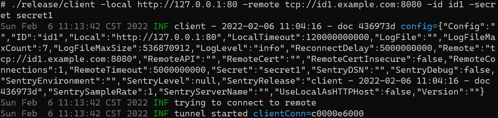

# gt

Focus on high-performance, low-latency, memory-saving intranet penetration solutions.

1. Supports HTTP, WebSocket protocol.
2. The server side supports multiple user configuration.
3. TCP connection pool is used for communication between server and client.
4. Logs can be reported to Sentry service.

## Contents

- [Working Principle](#working-principle)
- [Examples](#examples)
  - [HTTP](#http)
  - [HTTPS](#https)
  - [TLS Encrypts HTTP Between Client And Server](#tls-encrypts-http-between-client-and-server)
- [Parameters](#parameters)
  - [Client Parameters](#client-parameters)
  - [Server Parameters](#server-parameters)
  - [Configuration](#configuration)
  - [Server Specifies Users](#server-specifies-users)
    - [Via Command Line](#via-command-line)
    - [Through The Users Configuration File](#through-the-users-configuration-file)
    - [Through The Config Configuration File](#through-the-config-configuration-file)
- [Benchmark](#benchmark)
  - [gt](#gt-benchmark)
  - [frp](#frp-dev-branch-42745a3)
- [Compile](#compile)

## Working Principle


## Examples

### HTTP

- Requirements: There is an internal gt server and a public gt server, id1.example.com resolves to the address of the
  public gt server. Hope to visit the webpage served by port 80 on the intranet server by visiting id1.example.com:8080.

- Server (public)

```shell
./release/server -addr 8080 -id id1 -secret secret1
```


- Client (intranal)

```shell
./release/client -local http://127.0.0.1:80 -remote tcp://id1.example.com:8080 -id id1 -secret secret1
```



### HTTPS

- Requirements: There is an internal gt server and a public gt server, id1.example.com resolves to the address of the
  public gt server. Hope to visit the webpage served by port 443 on the intranet server by visiting id1.example.com:443.

- Server (public)

```shell
./release/server -addr 0 -tlsAddr 443 -certFile /root/openssl_crt/server.crt -keyFile /root/openssl_crt/server.key -id id1 -secret secret1
```


- The client (internal), because it uses a self-signed certificate, uses the -remoteCertInsecure option, otherwise it is
  forbidden to use this option (man-in-the-middle attacks cause encrypted content to be decrypted)

```shell
./release/client -local https://127.0.0.1:443 -remote tls://id1.example.com -remoteCertInsecure -id id1 -secret secret1
```


### TLS Encrypts HTTP Between Client And Server

- Requirements: There is an internal gt server and a public gt server, id1.example.com resolves to the address of the
  public gt server. I hope to visit the webpage served by port 80 on the intranet server by visiting id1.example.com:
  8080. At the same time, TLS is used to encrypt the communication between the client and the server.

- Server (public gt server)

```shell
./release/server -addr 8080 -tlsAddr 443 -certFile /root/openssl_crt/server.crt -keyFile /root/openssl_crt/server.key -id id1 -secret secret1
```


- The client (gt server), because it uses a self-signed certificate, so the use of the -remoteCertInsecureoption,
  otherwise prohibit the use of this option (middle attack led to the encrypted content is decrypted)

```shell
./release/client -local http://127.0.0.1:80 -remote tls://id1.example.com -remoteCertInsecure -id id1 -secret secret1
```


## Parameters

### Client Parameters

```shell
$ ./client -h
Usage of ./client:
  -config string
        The config file path to load
  -id string
        The unique id used to connect to server. Now it's the prefix of the domain.
  -local string
        The local service url
  -localTimeout duration
        The timeout for local connections (default 2m0s)
  -logFile string
        Path to save the log file
  -logFileMaxCount uint
        Max count of the log files (default 7)
  -logFileMaxSize int
        Max size of the log files (default 536870912)
  -logLevel string
        Log level: trace, debug, info, warn, error, fatal, panic, disable (default "info")
  -reconnectDelay duration
        The delay before reconnect (default 5s)
  -remote string
        The remote server url. Support tcp:// and tls://, default tcp://
  -remoteCert string
        The path to remote cert
  -remoteCertInsecure
        Accept self-signed SSL certs from remote
  -remoteConnections uint
        The number of connections to server (default 1)
  -remoteTimeout duration
        The timeout for remote connections (default 5s)
  -secret string
        The secret used to verify the id
  -sentryDSN string
        Sentry DSN to use
  -sentryDebug
        Sentry debug mode, the debug information is printed to help you understand what sentry is doing
  -sentryEnvironment string
        Sentry environment to be sent with events
  -sentryLevel value
        Sentry levels: trace, debug, info, warn, error, fatal, panic (default ["error", "fatal", "panic"])
  -sentryRelease string
        Sentry release to be sent with events
  -sentrySampleRate float
        Sentry sample rate for event submission: [0.0 - 1.0] (default 1)
  -sentryServerName string
        Sentry server name to be reported
  -version
        Show the version of this program
```

### Server Parameters

```shell
$ ./server -h
Usage of ./server:
  -addr string
        The address to listen on. Bare port is supported (default "80")
  -apiAddr string
        The address to listen on for internal api service. Bare port is supported
  -certFile string
        The path to cert file
  -config string
        The config file path to load
  -id value
        The user id
  -keyFile string
        The path to key file
  -logFile string
        Path to save the log file
  -logFileMaxCount uint
        Max count of the log files (default 7)
  -logFileMaxSize int
        Max size of the log files (default 536870912)
  -logLevel string
        Log level: trace, debug, info, warn, error, fatal, panic, disable (default "info")
  -secret value
        The secret for user id
  -sentryDSN string
        Sentry DSN to use
  -sentryDebug
        Sentry debug mode, the debug information is printed to help you understand what sentry is doing
  -sentryEnvironment string
        Sentry environment to be sent with events
  -sentryLevel value
        Sentry levels: trace, debug, info, warn, error, fatal, panic (default ["error", "fatal", "panic"])
  -sentryRelease string
        Sentry release to be sent with events
  -sentrySampleRate float
        Sentry sample rate for event submission: [0.0 - 1.0] (default 1)
  -sentryServerName string
        Sentry server name to be reported
  -timeout duration
        timeout of connections (default 1m30s)
  -tlsAddr string
        The address for tls to listen on. Bare port is supported
  -tlsVersion string
        The tls min version, supported values: tls1.1, tls1.2, tls1.3 (default "tls1.2")
  -users string
        The users yaml file to load
  -version
        Show the version of this program
```

### Configuration

The configuration file uses the yaml format, and both the client and the server can use configuration file. The client
in the [HTTP example](#http) can also be started with the following file (client.yaml). The startup command
is: `./release/client -config client.yaml`

```yaml
version: 1.0 # Reserved keywords, currently not used
options:
  local: http://127.0.0.1:80
  remote: tcp://id1.example.com:8080
  id: id1
  secret: secret1
```

### Server Specifies Users

The following three methods can be used at the same time. If conflicts are resolved, the priority will be lowered from
top to bottom.

#### Via Command Line

The i-th id matches the i-th secret. The following two startup methods are equivalent.

```shell
./release/server -addr 8080 -id id1 -secret secret1 -id id2 -secret secret2
```

```shell
./release/server -addr 8080 -id id1 -id id2 -secret secret1 -secret secret2
```

#### Through The Users Configuration File

```yaml
users:
  id3:
    secret: secret3
  id1:
    secret: secret1-overwrite
```

#### Through The Config Configuration File

```yaml
version: 1.0
users:
  id1:
    secret: secret1
  id2:
    secret: secret2
options:
  apiAddr: 1.2.3.4:1234
  certFile: /path
  host: 1.2.3.4
  keyFile: /path
  logFile: /path
  logFileMaxCount: 1234
  logFileMaxSize: 1234
  logLevel: debug
  addr: 1234
  timeout: 1234m1234ms
  tlsAddr: 1234
  tlsVersion: tls1.3
  users: testdata/users.yaml
```

## Benchmark

Stress test through wrk. This project is compared with frp. The intranet service points to the test page of running
nginx locally. The test results are as follows:

```text
Model Name: MacBook Pro
Model Identifier: MacBookPro17,1
Chip: Apple M1
Total Number of Cores: 8 (4 performance and 4 efficiency)
Memory: 16 GB
```

### gt benchmark

```shell
$ wrk -c 100 -d 30s -t 10 http://pi.example.com:7001
Running 30s test @ http://pi.example.com:7001
  10 threads and 100 connections
  Thread Stats   Avg      Stdev     Max   +/- Stdev
    Latency     2.22ms  710.73us  37.99ms   98.30%
    Req/Sec     4.60k   231.54     4.86k    91.47%
  1374783 requests in 30.01s, 1.09GB read
Requests/sec:  45811.08
Transfer/sec:     37.14MB

$ ps aux
  PID  %CPU %MEM      VSZ    RSS   TT  STAT STARTED      TIME COMMAND
 2768   0.0  0.1 408697792  17856 s008  S+    4:55PM   0:52.34 ./client -local http://localhost:8080 -remote tcp://localhost:7001 -id pi -threads 3
 2767   0.0  0.1 408703664  17584 s007  S+    4:55PM   0:52.16 ./server -port 7001
```

### frp dev branch 42745a3

```shell
$ wrk -c 100 -d 30s -t 10 http://pi.example.com:7000
Running 30s test @ http://pi.example.com:7000
  10 threads and 100 connections
  Thread Stats   Avg      Stdev     Max   +/- Stdev
    Latency    76.92ms   73.46ms 748.61ms   74.21%
    Req/Sec   154.63    308.28     2.02k    93.75%
  45487 requests in 30.10s, 31.65MB read
  Non-2xx or 3xx responses: 20610
Requests/sec:   1511.10
Transfer/sec:      1.05MB

$ ps aux
  PID  %CPU %MEM      VSZ    RSS   TT  STAT STARTED      TIME COMMAND
 2975   0.3  0.5 408767328  88768 s004  S+    5:01PM   0:21.88 ./frps -c ./frps.ini
 2976   0.0  0.4 408712832  66112 s005  S+    5:01PM   1:06.51 ./frpc -c ./frpc.ini
```

## Compile

```shell
git clone <url>
cd <folder>
# GOOS and GOARCH default to corresponding to the installed go
GOOS=linux GOARCH=386 make release
```

The compiled executable file is in the release directory.
